# Study Buddies 

<a href="https://studybuddies.onrender.com/">Live Link</a>

# Background and Overview 

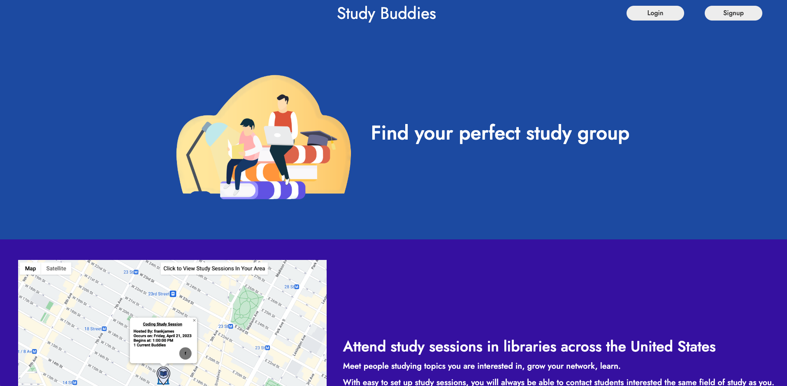

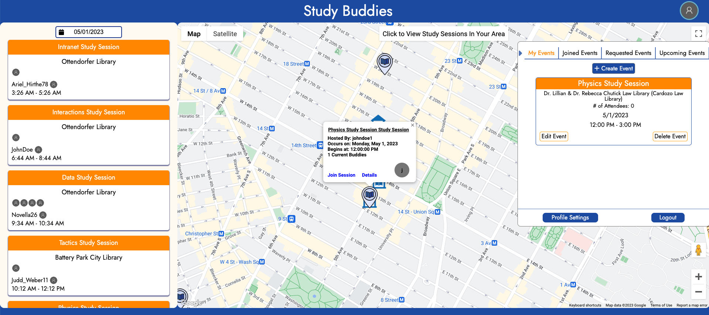

Study Buddies is an app that allows students to be able to create and attend study sessions. These study sessions will be held in libraries across America and can be easily organized by the study session creator. Utilizing the Google Maps API, students will be able to browse available study sessions in their area, create study sessions, and request to join existing study sessions. Study Buddies fosters learning by allowing students to build their network and find peers to study with. 

# Functionality and MVP 

## Feature 1 - User Auth 

Users must be able to sign up to create an account. Users must also be able to sign in and out of their account. Must be able to identify current user. 

## Feature 2 - User Profile

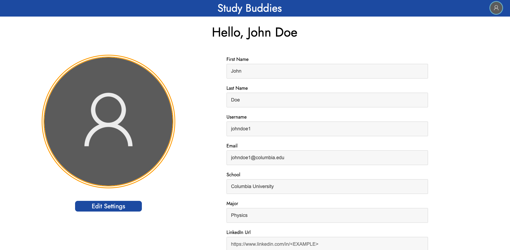

Users will have their own profiles where they can add more information about themselves. Users can update their information on their profile. 

```javascript 
    <div>
        <div className='usersettings-label'>First Name</div>
            <input className='edit-profile-input'
                value={firstName}
                onChange={(e) => setFirstName(e.target.value)}
                type='text'
                disabled
            />
    </div>

    <div>
        <div className='usersettings-label'>Last Name</div>
            <input className='edit-profile-input'
                value={lastName}
                onChange={(e) => setLastName(e.target.value)}
                type='text'
                disabled
            />
    </div>

     <div onClick={editSettings} id='editsettings-button'>Edit Settings</div>

      const editSettings = () => {
           let get = Array.from(document.getElementsByClassName('edit-profile-input'))
            get.forEach((input) => {
               input.disabled = false
            })
      }
```

In the user's settings page, the user's information is displayed in input fields that are disabled by default. When the user clicks the Edit button, the input fields are then enabled, allowing them to make changes.

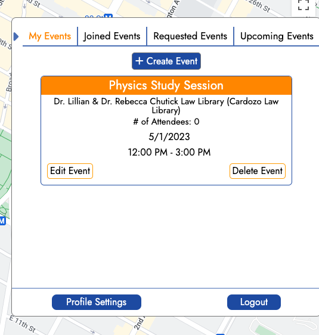

```javascript 
    <div id='events-holder'>
                        {
                            myEventTab &&
                            createdEvents.map(event => {
                                return <MyCreatedEvents event={event} key={event._id}/>
                            })
                        }
                        {
                            joinedEventTab &&
                            joinedEvents.map(event => {
                                return <MyCreatedEvents event={event} key={event._id}/>
                            })
                        }

                        {
                            requestedEventTab &&
                            requestedEvents.map(event => {
                                return <MyCreatedEvents event={event} key={event._id}/>
                            })
                        }
    </div>
```
When a user clicks on their profile icon in the upper right corner, a slideout component will render with tabs for "My Events", "Joined Events", and "Requested Events". These events are all stored in the store under the user.

## Feature 3 - Google Maps

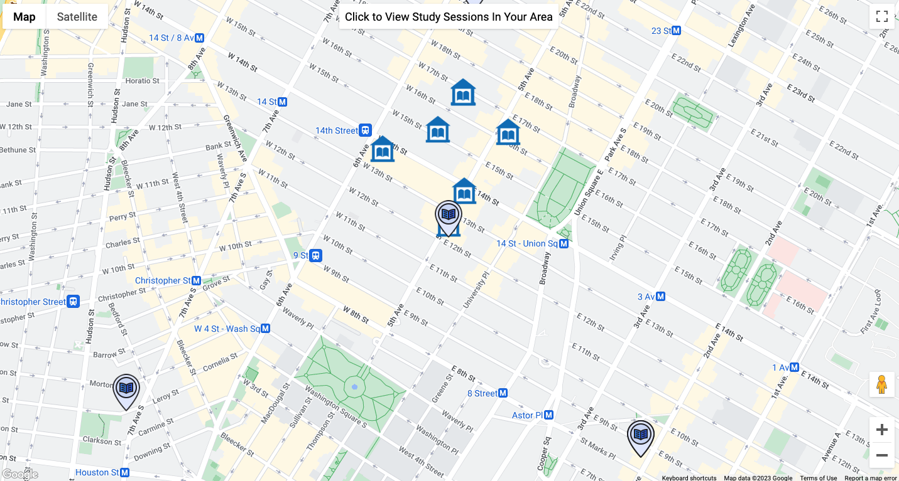

The Google Maps API will allow the user to browse study sessions around them on the map. 

```javascript
    let eventMarkers = [];
    events.forEach(event => {
        eventMarkers.push(new window.google.maps.Marker({
            position: {lat: event.location.latitude, lng: event.location.longitude},
            map: map, 
            title: event.description, 
            icon: {
                url: image, 
                scaledSize: new window.google.maps.Size(64, 64)
            }
        }));
    });
```

Creating all Study Event Markers and placing them on the map. 

```javascript
   function placeLibraries(results, status) {
		if (status == window.google.maps.places.PlacesServiceStatus.OK) {
			let googleFetchedLibraries = [];

			results.forEach(result => {
				let photoUrl = "https://upload.wikimedia.org/wikipedia/commons/6/60/Statsbiblioteket_l%C3%A6sesalen-2.jpg";
				
				if (result.photos) {
					photoUrl = result.photos[0].getUrl()
				}

				googleFetchedLibraries.push({
					name: result.name,
					latitude: result.geometry.location.lat(),
					longitude: result.geometry.location.lng(),
					imageUrl: photoUrl,
					address: result.vicinity
				})

				let resultLat = result.geometry.location.lat();
				let resultLng = result.geometry.location.lng();
				
				let eventMarker = new window.google.maps.Marker({
					position: {lat: resultLat, lng: resultLng},
					map: map, 
					icon: {
						url: libraryIcon, 
						scaledSize: new window.google.maps.Size(54, 54)
					},
					title: result.name,
					animation: window.google.maps.Animation.DROP
				});
				let eventInfoWindow = new window.google.maps.InfoWindow({
					content: result.name
				})
				eventMarker.addListener("click", () => {
					eventInfoWindow.open({
						anchor: eventMarker, 
						map: map
					})
				})
			})
			dispatch(receiveAllLocations(googleFetchedLibraries));
		}
	}
```

Placing Libraries on the map.

```javascript
    const findGeoLocation = () => {
		setGeoLocationClicked(false);
		setRequestedLibraries(false);

		if (!geoLocationClicked) {
			if (navigator.geolocation) {
				navigator.geolocation.getCurrentPosition(
					(position) => {
						const userLocation = {
							lat: position.coords.latitude, 
							lng: position.coords.longitude
						};
						userLocationCoords.current = userLocation; 
						const newMap = new window.google.maps.Map(ref.current, {
							center: { lat: userLocation.lat, lng: userLocation.lng},
							zoom: zoomAmount,
							styles: stylesArray
						})
						newMap.controls[window.google.maps.ControlPosition.TOP_CENTER].push(locationButton);
						setMap(newMap);
					},
					() => {
						handleLocationError(true, infoWindow, map.getCenter());
					}
				);
			} else {
				handleLocationError(false, infoWindow, map.getCenter());
			}
		}
	}
```

Geolocation functionality - When user requests to use their Geolocation.

## Feature 4 - Study Sessions (CRUD)

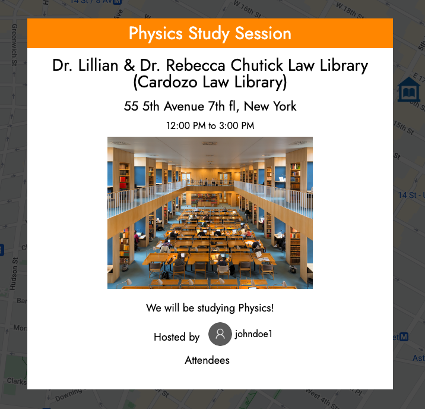

Users can create, read, update, and destroy study sessions. 
- Create - A user will be able to be the creator of a study session, allowing other users to request to join their session. 
- Read - Users will be able to see study sessions near them. 
- Update - A study session creator will be able to change the details of their study session (date and time, number of people attending, etc). 
- Destroy - A study creator will be able to delete their study session. 

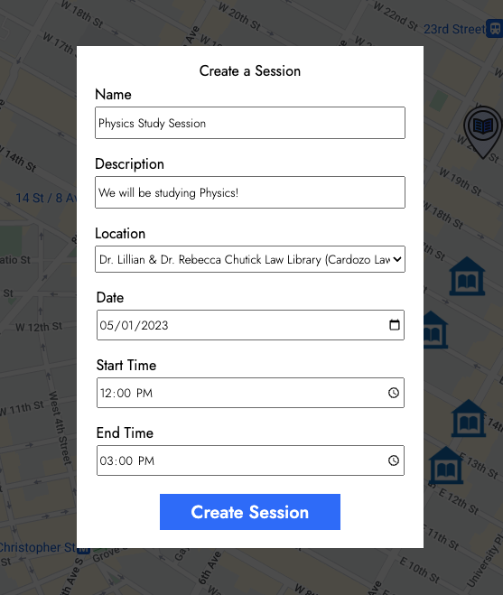

```javascript
    export const createEvent = (eventInfo) => async dispatch => {
        const res = await jwtFetch('/api/events', {
            method: 'POST',
            body: JSON.stringify(eventInfo),
            headers: {
                'Content-Type': 'application/json'
            }
        });

        const data = await res.json();
        dispatch(addCreatedEvent(data));
        
        const day = useSelector(selectedDate);
        dispatch(fetchAllEventsForDay(day.toLocaleDateString("en-us").split("T")[0]));
    }
```

A user can create a new event.

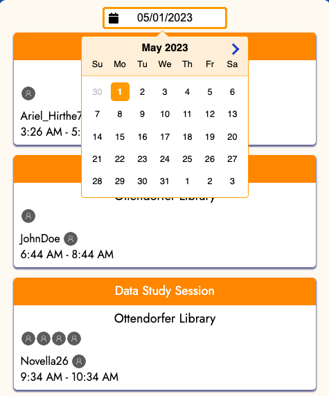

```javascript
    const EventSideBar = () => {
    const events = useSelector(getEvents);
    const selectedEvent = useSelector(selectedEventId);

    return (
        <div className="event-sidebar">
        <DateSelector id='dateselector'/>
        {
            events.map(event => {
            return <EventSidebarItem 
                        event={event} 
                        key={event._id} 
                        selected={selectedEvent === event._id}
                    />
            })
        }
        </div>
    )
    }
```

A user can browse through events for today or upcoming events using a date selector. When a date is selected, it will be saved in the store and the component that renders all the events will dispatch a thunk function to retrieve the events for the selected date.

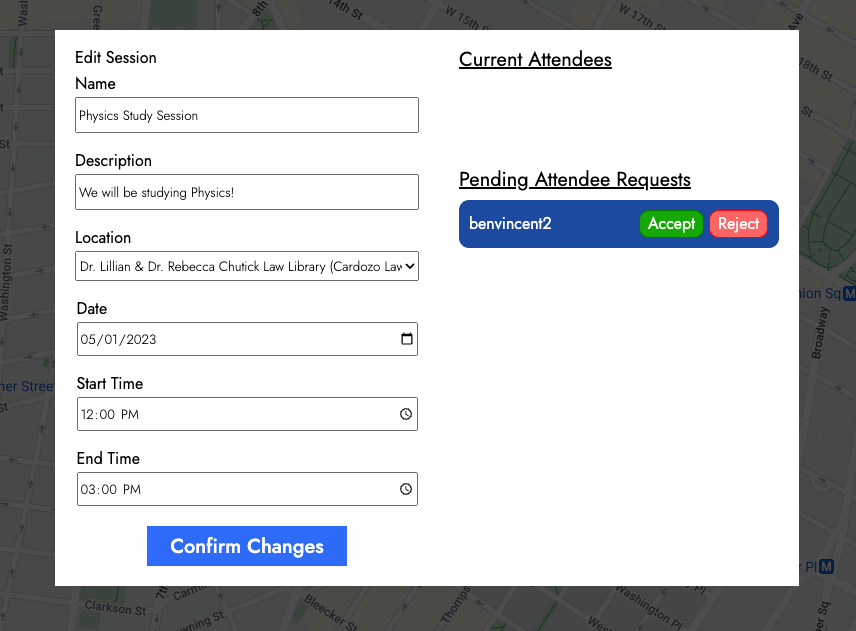

```javascript
    {
        currentAttendees.map((attendee) => {
                        let attendeeId = attendee._id
                        let eventId = event._id
                        return (
                            <div className='individual-attendee-container'>
                            <div>{attendee.username}</div>
                            <div className='attendee-options' id='reject-button' onClick={handleKick(eventId, attendeeId)}>Kick</div>
                            </div>
                        )
                    })
    }

    const handleKick = (eventId, attendeeId) => () => {
        dispatch(deleteAttendee(eventId, attendeeId))
    }
```

A user can only edit events that they've created. The edit form is prefilled with the current details of the event. The creator is allowed to kick attendees and accept/deny pending requests.

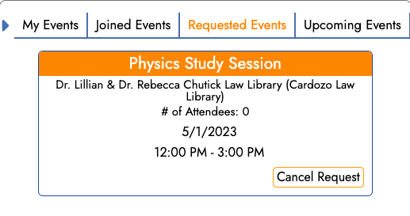

```javascript
    const handleLeave = (e) => {
            e.preventDefault();
            dispatch(deleteEvent(event._id))
    }

    const handleRequest = (e) => {
            e.preventDefault();
            dispatch(deleteRequest(event._id))
    }

    export const deleteRequest = (eventId) => async dispatch => {
        const res = await jwtFetch(`/api/events/${eventId}/requests`, {
            method: "DELETE"
        })

        dispatch(deleteRequestedEvent(eventId));
    }

    export const deleteEvent = (eventId) => async dispatch => {
        const res = await jwtFetch(`/api/events/${eventId}`, {
            method: 'DELETE'
        })

        const data = await res.json();
        if (data === "created deleted") {
            dispatch(deleteCreatedEvent(eventId));
        } else if (data === "joined deleted") {
            dispatch(deleteJoinedEvent(eventId));
        }

        const day = useSelector(selectedDate);
        dispatch(fetchAllEventsForDay(day.toLocaleDateString("en-us").split("T")[0]));
    }
```

For "Joined Events" and "Requested Events", the current user can leave the event or rescind their request.


## Feature 5 - Upcoming Events 

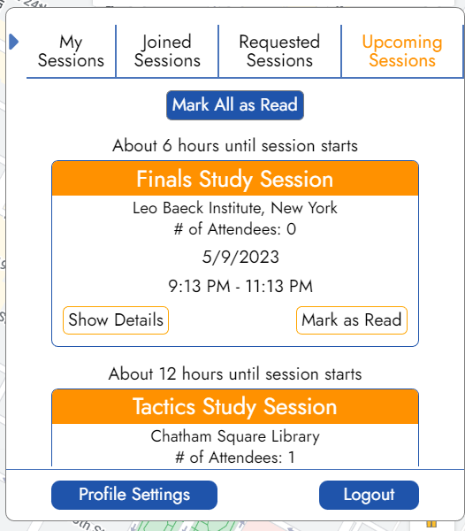

Users will be able to see upcoming events they have created or joined. They can also also mark each or all upcoming events as read, and will persist on refresh.

``` javascript
const createNotifications = () => {
  const allMyEvents = createdEvents.concat(joinedEvents);
  const newNotifications = {
    "<1 hour": {},
    "6 hours": {},
    "12 hours": {}
  }
  
  const today = new Date();
  allMyEvents.forEach(event => {
      const startTime = new Date(event.startTime);
      const minDiff = Math.floor((startTime - today) / 1000 / 60)
      
      if (minDiff < 0) return;
      if (minDiff <= 60) { // 1 hour
        if (notifications["<1 hour"][event._id] !== null) {
          newNotifications["<1 hour"][event._id] = event;
        } else {
          newNotifications["<1 hour"][event._id] = null;
        }
      } else if (minDiff <= 360) { // 6 hours
        if (notifications["6 hours"][event._id] !== null) {
          newNotifications["6 hours"][event._id] = event;
        } else {
          newNotifications["6 hours"][event._id] = null;
        }
      } else if (minDiff <= 720) { // 12 hours
        if (notifications["12 hours"][event._id] !== null) {
          newNotifications["12 hours"][event._id] = event;
        } else {
          newNotifications["12 hours"][event._id] = null;
        }
      }
  })

  dispatch(receiveNotifications(newNotifications));
}

useEffect(() => {
  createNotifications();
  // updates notifications every half hour
  const notificationInterval = setInterval(createNotifications, 1800000);

  return () => {
      clearInterval(notificationInterval);
  }
}, [])
```

Upcoming events are determined on the frontend through the createNotifications functions. A useEffect calls it on initial load of the home page, and then sets up an interval to periodically update it every half hour.


``` javascript
const initialState = JSON.parse(localStorage.getItem("notifications")) || {
  "<1 hour": {},
  "6 hours": {},
  "12 hours": {}
}

const notificationsReducer = (state=initialState, action) => {
  let nextState = {...state}
  switch (action.type) {
    case RECEIVE_NOTIFICATIONS:
        localStorage.setItem("notifications", JSON.stringify({...action.notifications}))
        return {...action.notifications}
    case HIDE_NOTIFICATION:
        nextState[action.payload.notificationType][action.payload.eventId] = null;
        localStorage.setItem("notifications", JSON.stringify(nextState));
        return nextState;
      case HIDE_ALL_NOTIFICATIONS:
        Object.keys(nextState).forEach(notificationType => {
          Object.keys(nextState[notificationType]).forEach(eventId => {
            nextState[notificationType][eventId] = null;
          })
        })
        localStorage.setItem("notifications", JSON.stringify(nextState));
        return nextState;
    default:
        return state;
  }
}
```

The notifications reducer will save and retrieve notifications in local storage and the redux state.

```javascript
{
    notificationTab &&
    Object.keys(notifications).map(timeNotification => {

        return (
            <div key={timeNotification}>
                <span className="notification-time">
                    {
                        timeNotification === "<1 hour"
                            ? "About an hour until session starts"
                            : timeNotification === "6 hours"
                                ? "About 6 hours until session starts"
                                : "About 12 hours until session starts"
                    }
                </span>
                {
                    Object.values(notifications[timeNotification]).map(event => {
                        if (!event) return null;
                        return <MyCreatedEvents event={event} notificationType={timeNotification} key={event._id}/>
                    })
                }
            </div>
        )
    })
}
```

In the ProfileModal component, upcoming event notifications are displayed in 3 different groups (Less than an hour, about 6 hours, about 12 hours). Upcoming events marked as read become null, and no longer get displayed.

## Backend

```javascript
    // GET all events within a date range
    router.get('/', async (req, res) => {
    try {
        const startDay = new Date(req.query.startDate);

        let endDay;
        if (req.query.endDate) {
        endDay = new Date(req.query.endDate);
        } else {
        endDay = new Date(req.query.startDate);
        endDay.setDate(endDay.getDate() + 1);
        }
        
        const events = await Event.find({
        startTime: {
            $gte: startDay,
            $lt: endDay
        }
        })
        .populate("creator", "_id username profileImageUrl")
        .populate("attendees", "_id username profileImageUrl")
        .populate("location", "_id name latitude longitude imageUrl")
        .sort({ startTime: 1 });

        return res.json(events);
    } catch(err) {
        return res.json([]);
    }
    });

    // DELETE event or DELETE attendance
    router.delete('/:id', requireUser, async (req, res, next) => {
    try {
        const event = await Event.findById(req.params.id);

        if (event.creator.toString() === req.user._id.toString()) {
        // delete event from creator's createdEvents
        await User.updateOne(
            { _id: req.user._id }, 
            { $pullAll: { createdEvents: [event._id] }}
        )
        
        // delete event from each attendees' attendedEvents
        await User.updateMany(
            { _id: { $in: event.attendees } },
            { $pullAll: { attendedEvents: [event._id] }}
        )

        // delete event from each requesters' attendedEvents
        await User.updateMany(
            { _id: { $in: event.requesters } },
            { $pullAll: { requestedEvents: [event._id] }}
        )

        // delete the event itself
        await event.deleteOne();

        return res.json("created deleted");
        } else {
        // delete event from current user's joinedEvents
        await User.findByIdAndUpdate(
            req.user._id,
            { $pullAll: { joinedEvents: [event._id] } }
        )

        await Event.findByIdAndUpdate(
            req.params.id,
            {$pullAll: {attendees: [req.user._id] } }
        )

        return res.json("joined deleted");
        }
    } catch(err) {
        const error = new Error('Event not found');
        error.statusCode = 404;
        error.errors = { message: "No event found with that id" };
        return next(error);
    }
    })

    // UPDATE request status
    router.patch('/:id/requests/:userId', requireUser, async (req, res, next) => {
    try {
        const event = await Event.findById(req.params.id);

        if (event.creator.toString() !== req.user._id.toString()) {
        ...// error handling
        }

        const user = await User.findById(req.params.userId);

        let idx = event.requesters.indexOf(user._id)
        event.requesters.splice(idx, 1);

        idx = user.requestedEvents.indexOf(event._id)
        user.requestedEvents.splice(idx, 1);

        if (req.body.choice === "accept") {
        event.attendees.push(user._id);
        user.joinedEvents.push(event._id);
        }

        await user.save();
        await event.save();

        ...// format updated event for response

        return res.json(updatedEvent);
    } catch(err) {
        ...// error handling
    }
    })

    // DELETE attendee
    router.delete('/:id/attendees/:userId', requireUser, async (req, res, next) => {
    try {
        const event = await Event.findById(req.params.id);
        if (event.creator.toString() !== req.user._id.toString()) {
        ...// error handling
        }

        const user = await User.findById(req.params.userId)

        let idx = event.attendees.indexOf(user._id)
        event.attendees.splice(idx, 1);

        idx = user.joinedEvents.indexOf(event._id)
        user.joinedEvents.splice(idx, 1);

        await user.save();
        await event.save();
        
        ...// format updated event for response

        return res.json(updatedEvent);
    } catch(err) {
        ...// error handling
    }
    })
```

## Bonus Features

- Live chat
- User status
- Friends

# Technologies and Technical Challenges

## Technologies implemented:
- MongoDB
- Express
- React and Redux
- Node.js 
- Amazon S3 (coming soon)
- Google Maps API 
- Google Maps - Places API

# Group Members and Work Breakdown

## Group members:
- Kelsang Tsering - Team Lead 
- Ying Zhou - Frontend Lead
- Fahim Khan - Backend Lead
- Justin Diner - Flex

## Schedule:
Monday (4/16):
- Kelsang: 
    - Work on frontend logic and styling for User Profile feature
- Ying: 
    - Work on frontend logic and styling for User Profile feature
- Fahim
    - Work on backend logic for User Profile feature
- Justin
    - Work on Google Maps API 

Tuesday (4/17):
- Kelsang: 
    - Work on frontend logic and styling for Study Sessions
- Ying: 
    - Work on frontend logic and styling for Study Sessions 
- Fahim
    - Work on backend for Study Sessions
- Justin
    - Finalize Google Maps API logic

Wednesday (4/16):
- Kelsang: 
    - Work on frontend logic and styling for Upcoming Events 
- Ying: 
    - Work on frontend logic and styling for Upcoming Events 
- Fahim
    - Work on backend logic for Upcoming Events
- Justin
    - Work on frontend logic and styling for Upcoming Events + backend 

Thursday (4/16):
- Kelsang: 
    - Work on frontend logic and styling for bonus features if possible 
- Ying: 
    - Work on frontend logic and styling for bonus features if possible 
- Fahim
    - Work on backend logic for bonus features if possible 
- Justin
    - Work on backend logic for bonus features if possible